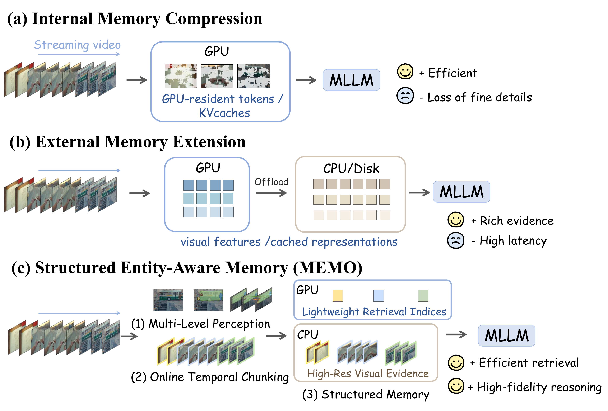
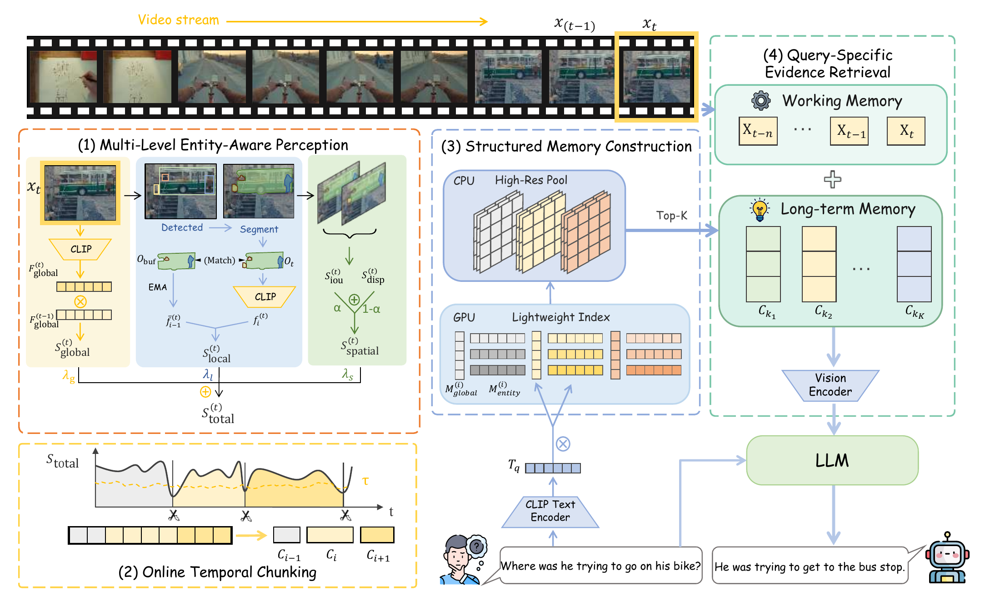

<div align="center">

# MEMO

**Multi-Level Entity-Aware Memory for Streaming Video Understanding**

ACM Multimedia 2026 · [Paper](https://arxiv.org/abs/2609.38900) · [Citation](CITATION.cff) · [MIT License](LICENSE)

</div>

MEMO is a training-free memory framework for streaming video understanding. It segments a video into semantic chunks using global, entity, and spatial cues, then retrieves visual evidence for each question.

<p align="center">
  <a href="assets/teaser.png"></a>
</p>
<p align="center"><em>MEMO keeps lightweight retrieval indices separate from high-resolution visual evidence.</em></p>

## Overview

- **Multi-level perception:** CLIP, Grounding-DINO, and SAM2 capture scene and entity information.
- **Online memory:** adaptive chunks retain lightweight retrieval indices on GPU and visual evidence on CPU.
- **Question answering:** the top 3 historical chunks and the current chunk supply up to 8 + 8 frames to an MLLM.

<p align="center">
  <a href="assets/pipeline.png"></a>
</p>
<p align="center"><em>MEMO processes incoming frames, builds structured memory, and retrieves evidence for each query.</em></p>

## Main Results

The following online-method results are from [Table 1 of the paper](https://arxiv.org/pdf/2609.38900). Values are average accuracy (%): OVO-Bench uses its six real-time tasks; StreamingBench uses its real-time subset. The full per-task table is in the paper.

**Online methods with training**

| Method | Frames | OVO-Bench | StreamingBench |
| --- | ---: | ---: | ---: |
| VideoLLM-online-8B | 2 fps | 20.8 | 36.0 |
| Dispider-7B | 1 fps | 54.6 | 67.6 |
| Flash-VStream-7B | 1 fps | 29.9 | 23.2 |
| ViSpeak | 1 fps | 66.3 | 74.4 |
| TimeChat-Online-7B | 1 fps | 61.9 | 75.3 |
| StreamForest-7B | 1 fps | 61.2 | 77.3 |

**Training-free online methods**

| Backbone / method | Frames | OVO-Bench | StreamingBench |
| --- | ---: | ---: | ---: |
| LLaVA-OneVision-0.5B | 32 | 49.7 | 59.6 |
| ↳ + ReKV | 0.5 fps | 43.8 | 57.4 |
| ↳ **+ MEMO** | 1 fps | 50.4 | 59.5 |
| LLaVA-OneVision-7B | 32 | 63.1 | 71.1 |
| ↳ + ReKV | 0.5 fps | 57.3 | 69.1 |
| ↳ + LiveVLM | 0.5 fps | — | 72.9 |
| ↳ + StreamKV | 0.5 fps | — | 68.8 |
| ↳ **+ MEMO** | 1 fps | 66.6 | 73.2 |
| Qwen2.5-VL-7B | 1 fps | 59.9 | 73.3 |
| ↳ + FluxMem | 1 fps | 67.2 | 76.4 |
| ↳ **+ MEMO** | 1 fps | 66.9 | 78.5 |
| Qwen3-VL-8B | 1 fps | 70.1 | 73.2 |
| ↳ **+ MEMO** | 1 fps | **76.0** | **83.7** |

These are the paper's reported results; the [LaTeX source for these online rows](docs/ONLINE_RESULTS.tex) is provided for reuse. Full benchmark scores have not been regenerated with this release. See [Protocol and Provenance](docs/PROTOCOL.md) and [Validation](docs/VALIDATION.md).

## Getting Started

Inference needs Linux, Python 3.10, one NVIDIA CUDA GPU, and model weights. Follow [Setup and Model Weights](docs/SETUP.md) first.

Validate the bundled synthetic example without loading models:

```bash
python reproduce.py \
  --config configs/smoke.json \
  --annotations examples/synthetic/custom.json \
  --video-root examples/synthetic \
  --validate-only
```

Run it with Qwen3-VL-8B:

```bash
CUDA_VISIBLE_DEVICES=0 python reproduce.py \
  --config configs/smoke.json \
  --annotations examples/synthetic/custom.json \
  --video-root examples/synthetic \
  --model-path weights/Qwen3-VL-8B-Instruct \
  --output results/smoke.json
```

The main configurations are in `configs/main/` (four backbones × two benchmarks). See [Dataset Preparation](docs/DATASETS.md) and [Benchmark Evaluation](docs/EVALUATION.md) for full commands, baselines, profiling, and result checks. Custom JSON data is covered in [Custom Datasets](docs/CUSTOM_DATASET.md).

## Repository Guide

| Path | Purpose |
| --- | --- |
| `reproduce.py`, `configs/` | Experiment entry point and configurations |
| `benchmarks/`, `stage1/` | Annotation readers and sampled video decoding |
| `stage2/`, `stage3_gpu/` | Perception, chunking, and memory retrieval |
| `eval/`, `scripts/` | Model adapters, temporal evaluation, and reports |
| `docs/`, `tests/` | Protocol details and validation |

## Citation and License

Please cite the [MEMO paper](https://arxiv.org/abs/2609.38900); citation metadata is in [CITATION.cff](CITATION.cff). The code is released under the [MIT License](LICENSE). Model weights and benchmark data have their own terms; see [NOTICE.md](NOTICE.md).
